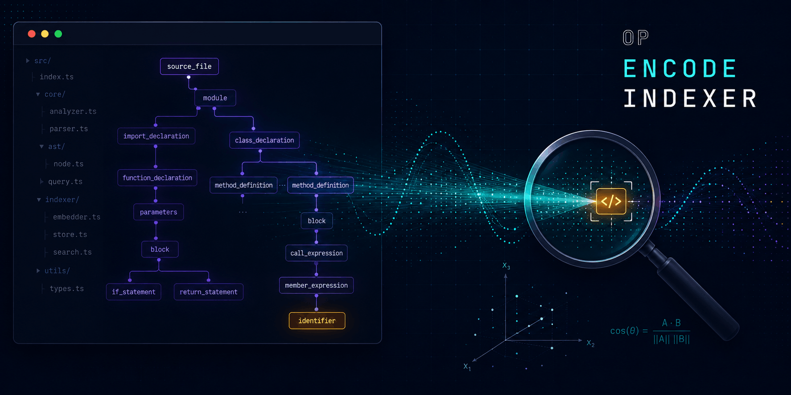
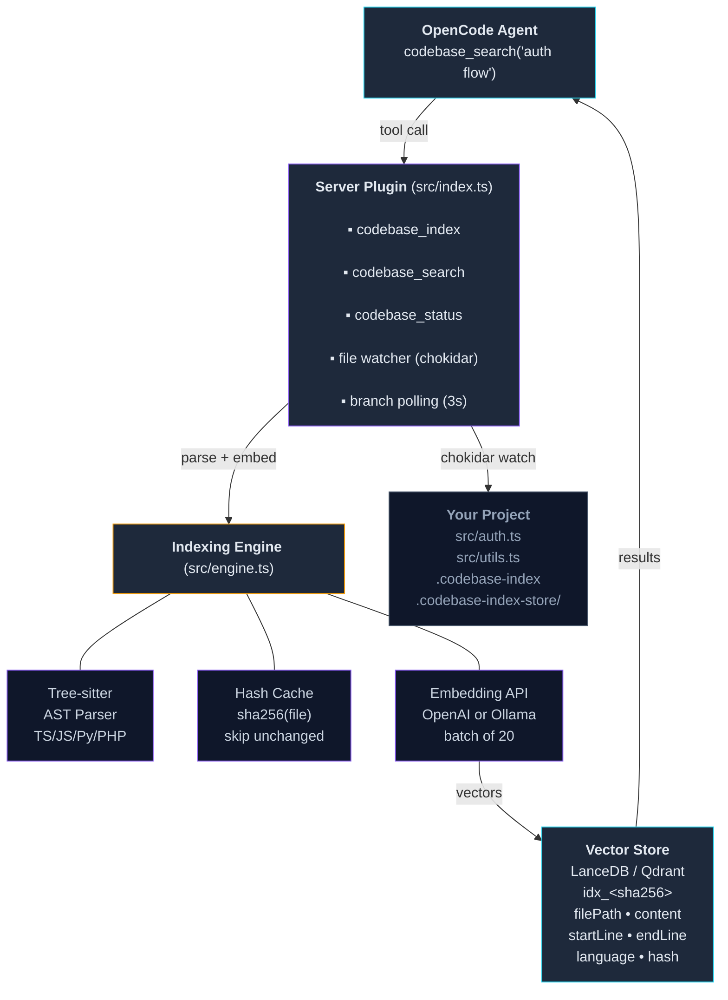
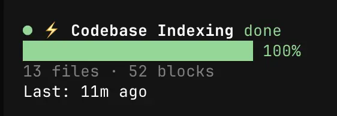

# OpenCode Indexer

<p align="center">
  
</p>

**Semantic code search for OpenCode** — a plugin that indexes your project's source code into a vector database and enables the AI agent to search it using natural language. Tree-sitter AST parsing produces clean semantic blocks (functions, classes, methods). Hash caching skips unchanged files on re-index — fast incremental updates. A live TUI sidebar shows real-time indexing progress with themed colors.

Instead of grepping for exact keywords, ask "how does authentication work" and find relevant code across your entire project.

---

## Quick Start

### 1. Install

```bash
git clone https://github.com/jbpraxxys/opencode-indexer.git ~/opencode-indexer
cd ~/opencode-indexer
npm install
npm run build
```

### 2. Configure — Server (tools)

Add the plugin to `~/.config/opencode/opencode.json`:

```json
"plugin": [
    ["~/opencode-indexer", {
        "embedder": "openai",
        "openaiApiKey": "sk-...",
        "model": "text-embedding-3-small"
    }]
]
```

This registers the three tools (`codebase_index`, `codebase_search`, `codebase_status`) with the OpenCode agent.

### 3. Configure — TUI Sidebar

The TUI sidebar panel (live indexing progress bar, phase label, file/block counts) is a separate plugin entry. Without it, indexing still works but you won't see progress in the sidebar.

Add to `~/.config/opencode/tui.json`:

```json
{
    "$schema": "https://opencode.ai/tui.json",
    "plugin": ["~/opencode-indexer"]
}
```

The TUI loader resolves the directory and picks up `./src/tui.tsx` via the `package.json` exports — no extra configuration needed.
That's it — LanceDB is the default vector store (zero setup). No server, no Docker.

### 4. Opt in a project

```bash
cd ~/Sites/my-project
touch .codebase-index
```

### 5. Restart OpenCode and start searching

```
opencode ~/Sites/my-project
```

The three tools (`codebase_index`, `codebase_search`, `codebase_status`) appear automatically. On first search, the indexer auto-builds the index — no manual `codebase_index` call needed.

```text
You: codebase_search "how does user login work"

Agent: [Instantly finds auth-related code across your project...]
```

### 6. Install the agent skill (strongly recommended)

The skill tells the AI agent to **check `codebase_status` first** (free, no API call), then **always use `codebase_search`** before falling back to grep/glob/find. Without it, the agent may waste context on regex searches or make parallel search calls into non-opted-in projects:

```bash
mkdir -p ~/.config/opencode/skills/opencode-indexer
cp skills/opencode-indexer/SKILL.md ~/.config/opencode/skills/opencode-indexer/
```

Or symlink for auto-updates when you pull new versions:

```bash
mkdir -p ~/.config/opencode/skills
ln -s "$(pwd)/skills/opencode-indexer" ~/.config/opencode/skills/opencode-indexer
```

### Switching to Qdrant

If you need an external vector store for team deployments:

```json
"plugin": [["~/opencode-indexer", {
    "embedder": "openai",
    "openaiApiKey": "sk-...",
    "vectorStore": "qdrant",
    "qdrantUrl": "http://localhost:6333"
}]]
```

Run Qdrant locally (`./qdrant`) or connect to Qdrant Cloud with `qdrantApiKey`.

---

## Architecture



**Flow:**

1. Agent calls `codebase_search("auth flow")`
2. Plugin auto-indexes if no index exists (first use)
3. Tree-sitter parses files into semantic blocks (functions, classes)
4. Hash cache checks each file — skips unchanged, re-parses changed
5. Embedding API converts blocks → vectors
6. Vector store stores vectors with metadata
7. Query embedding → cosine similarity search → formatted results
8. File watcher detects edits → re-indexes only the changed file
9. **Branch polling detects `git checkout` → full re-index with hash caching (if `branchAware` enabled)**

---

## What's New

| Feature                          | Description                                                                                     |
| -------------------------------- | ----------------------------------------------------------------------------------------------- |
| **Live TUI Sidebar**             | Real-time progress bar, phase label, file/block counts — themed colors, no console noise        |
| **Zero-Dependency LanceDB**      | Embedded vector store — no server, no Docker, no API key (default)                              |
| **Tree-sitter AST Parsing**      | Extracts functions, classes, and methods as semantic blocks for TS, JS, Python, and PHP         |
| **Hash Caching**                 | SHA-256 per-file hashes — re-indexing only processes changed files                              |
| **Branch-Aware Indexing**        | Polls `.git/HEAD` every 3s — auto re-indexes on branch switch (opt-in)                          |
| **.gitignore + .opencodeignore** | Respects project-level ignore rules (layered: defaults → .gitignore → .opencodeignore)          |
| **Progress File**                | Live progress (phase, percentage, counts) written to `.codebase-index-store/progress.json` during indexing; persisted state written to `.opencode/state/opencode-indexer/state.json` after completion     |
| **Deleted File Detection**       | Automatically removes orphaned blocks when files are deleted                                    |
| **Consolidated Storage**         | Single `.codebase-index-store/` folder — LanceDB, progress, and branch tracking in one place    |

---

## Setup Options

### Embedding Provider

**OpenAI** (recommended for quality) — set `embedder: "openai"` with your API key.

**Ollama** (local, free) — install [Ollama](https://ollama.com), then:

```bash
ollama pull nomic-embed-text
```

Then configure: `"embedder": "ollama"`, `"model": "nomic-embed-text"`.

### Vector Store

**LanceDB** (default) — embedded, file-based. Nothing to install.

**Qdrant** (external) — for team deployments. Download and run:

```bash
curl -L https://github.com/qdrant/qdrant/releases/latest/download/qdrant-x86_64-apple-darwin.tar.gz -o qdrant.tar.gz
tar xzf qdrant.tar.gz && ./qdrant
```

Then set `"vectorStore": "qdrant"` in config. Verify with `curl http://localhost:6333/healthz`.

---

## Usage

### Inside OpenCode

Three tools available to the AI agent:

| Tool              | What it does                                           |
| ----------------- | ------------------------------------------------------ |
| `codebase_index`  | Index the project (tree-sitter parsing + hash caching) |
| `codebase_search` | Semantic search across indexed code                    |
| `codebase_status` | Check index stats                                      |

The agent follows a **Search Priority Rule**: checks `codebase_status` first (instant, free), then uses `codebase_search` for all code search, falling back to grep/glob only if semantic search returns no results. This prevents wasted calls on non-opted-in projects. The agent skill (step 5 above) reinforces this rule with a rationalization table and red flags — install it so the agent never reaches for grep first.

### TUI Sidebar

When indexing, a live sidebar panel appears showing real-time progress:

<p align="center">
  
</p>

- **Status indicator** — `●` colored circle: gray for idle, orange (breathing) during indexing, green at 100%
- **Progress bar** — `█` filled, `░` unfilled, with percentage
- **Phase label** — inline in header, color-coded: muted for idle, accent for active, green for done
- **Stats** — file and block counts in muted text
- **Last indexed** — shown when available

The sidebar polls for live progress (`.codebase-index-store/progress.json`, written by the engine during indexing) and falls back to the persisted state file (`.opencode/state/opencode-indexer/state.json`, written by the server after completion) every 2 seconds. No console.log noise.

### Auto-Indexing (File Watcher + Branch Detection)

When OpenCode runs in an opted-in project, two mechanisms keep the index fresh:

**File Watcher (chokidar):**

| Action            | Result                                     |
| ----------------- | ------------------------------------------ |
| Save/edit a file  | Re-indexes only that file (600ms debounce) |
| Create a new file | Indexes immediately                        |
| Delete a file     | Removes its blocks from the store          |

**Branch Detection (opt-in via `branchAware`):**

Reads `.git/HEAD` directly (no subprocess) — poll interval configurable via `branchPollMs`.

| Action            | Result                                                 |
| ----------------- | ------------------------------------------------------ |
| Switch branches   | Full re-index (hash cache — unchanged = free)          |
| Detached HEAD     | Polling suspends until back on a named branch          |
| Change detected   | Re-indexes silently — TUI sidebar reflects live state  |
| Poll failure      | Logs error to console, retries next interval           |

No full re-index. No API waste. Just the delta.

### CLI Tool

```bash
node cli.mjs index ~/Sites/my-project    # Full index
node cli.mjs search ~/Sites/my-project "auth flow"  # Search
node cli.mjs status ~/Sites/my-project   # Stats
node cli.mjs clear ~/Sites/my-project    # Delete index
```

---

## How It Works

### Indexing Pipeline

1. **File Discovery** — glob scan with `.gitignore` + `.opencodeignore` support
2. **Tree-sitter AST Parsing** — extracts functions, classes, methods for TS/JS/Python/PHP; falls back to line-based chunking for other languages
3. **Hash Check** — if `sha256(file)` matches stored hash, skip (unchanged)
4. **Embedding** — batches of 20 code blocks → embedding API (20K char truncation for token limits)
5. **Storage** — LanceDB (default, embedded) or Qdrant with metadata (file path, line numbers, language, file hash)

### Search Pipeline

1. **Query Embedding** — natural language → vector
2. **Cosine Similarity Search** — vector store returns closest matches
3. **Result Formatting** — file paths, line numbers, similarity scores, code previews

### Hash Caching

On re-index, only changed files are processed:

```
📖 Scanned 159/159 files — 157 unchanged, 2 updated
✅ All 157 files unchanged — index is up to date
```

Deleted files are detected and purged automatically. No stale blocks.

---

## Configuration

| Option          | Default                    | Description                                    |
| --------------- | -------------------------- | ---------------------------------------------- |
| `embedder`      | `"ollama"`                 | `"openai"` or `"ollama"`                       |
| `model`         | `"nomic-embed-text"`       | Embedding model                                |
| `openaiBaseUrl` | `"https://api.openai.com"` | OpenAI-compatible endpoint                     |
| `openaiApiKey`  | —                          | API key (required for openai)                  |
| `ollamaUrl`     | `"http://localhost:11434"` | Ollama server                                  |
| `vectorStore`   | `"lancedb"`                | `"qdrant"` or `"lancedb"`                      |
| `qdrantUrl`     | `"http://localhost:6333"`  | Qdrant server                                  |
| `qdrantApiKey`  | —                          | API key for Qdrant Cloud                       |
| `batchSize`     | `20`                       | Embedding batch size                           |
| `maxResults`    | `20`                       | Max search results                             |
| `minScore`      | `0.4`                      | Similarity threshold                           |
| `maxFileSize`   | `1000000`                  | Max file size in bytes (1MB)                   |
| `branchAware`   | `false`                    | Auto re-index on git branch switch             |
| `branchPollMs`  | `3000`                     | Poll interval for branch change detection (ms) |

---

## Supported Languages

| Tree-sitter AST (semantic blocks)  | Line-based (fallback)            |
| ---------------------------------- | -------------------------------- |
| TypeScript (.ts, .tsx)             | Ruby, Go, Rust, Java, Kotlin     |
| JavaScript (.js, .jsx, .mjs, .cjs) | C, C++, Swift, Zig               |
| Python (.py)                       | CSS, SCSS, HTML, Vue, Svelte     |
| PHP (.php)                         | Markdown, JSON, YAML, TOML, Bash |

---

## Project Isolation

Each project gets its own vector store collection/table (`idx_<sha256>`). All indexer data lives under `.codebase-index-store/` (LanceDB, progress, branch tracking). The `.codebase-index` marker file at root is the only other file. Indexes never mix between projects.

---

## File Structure

```
~/opencode-indexer/
├── cli.mjs              # CLI (index, search, status, clear)
├── dist/
│   ├── engine.js        # Core: parser, embedder, vector store, hash cache
│   ├── index.js         # Server plugin: 3 tools + watcher + system prompt
│   └── tui.js           # TUI plugin: sidebar progress bar + state display
├── src/
│   ├── engine.ts        # Tree-sitter, hash caching, progress file, Qdrant/LanceDB
│   ├── index.ts         # Plugin entry: tools, chokidar watcher, priority rule
│   └── tui.tsx          # TUI sidebar: themed progress bar, phase label, stats
├── skills/
│   └── opencode-indexer/
│       └── SKILL.md     # Agent skill — enforces search priority rule
├── banner.png           # Project banner
├── tui.json             # TUI sidebar plugin entry
├── package.json
└── tsconfig.json
```

---

## Troubleshooting

**LanceDB issues:** Delete `.codebase-index-store/` and re-index: `codebase_index(force=true)`. LanceDB data is per-project, so there's no server to restart.

**Qdrant not available:** `curl http://localhost:6333/healthz`

**Embedding API error:** Check API key and base URL. Blocks truncated to 20K chars to stay within token limits.

**Plugin not showing tools:** Restart OpenCode. Check `opencode plugin list`.

**Too many blocks (noise):** The glob ignore fix ensures `node_modules`, `vendor`, etc. are excluded. If you have a stale index, run `codebase_index(force=true)`.

**Re-index a project:** `codebase_index(force=true)` in OpenCode, or `node cli.mjs index .` from CLI.

**Switch between LanceDB and Qdrant:** Change `vectorStore` in your config and re-index with `force=true`. Old data in the previous store is not automatically deleted — remove it manually (`.codebase-index-store/` folder or Qdrant collection).

### "Too many open files" in Qdrant (macOS binary)

Running Qdrant directly on macOS may hit the file descriptor limit:

```
Os { code: 24, kind: Uncategorized, message: "Too many open files" }
```

**Check current limits:**

```bash
ulimit -n
launchctl limit maxfiles
```

**Permanent fix (requires reboot):**

```bash
sudo launchctl config system maxfiles 65536 200000
sudo launchctl config user   maxfiles 65536 200000
```

**Shell default (zsh):** Add to `~/.zshrc`:

```bash
ulimit -n 65536
```

**Quick test (session only):**

```bash
ulimit -n 65536
./qdrant
```

After reboot, confirm with `ulimit -n` before launching Qdrant.
